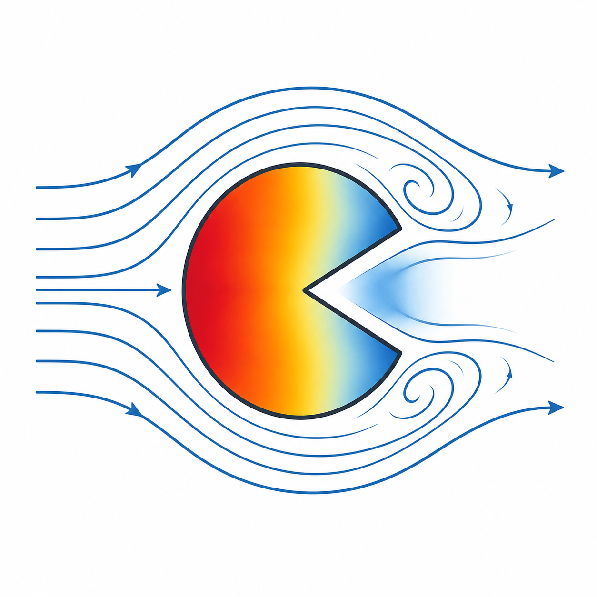

# PACMAN (Portable Algorithms for Coupling, Mapping, and Adaptive iNterpolation)

<p align="center">
  
</p>


[](https://messahelramzi.github.io/pacman/docs/doxygen/html/index.html)

## Description

PACMAN is a C++ library with Python/Fortran bindings that provides portable algorithms for coupling, mapping, and adaptive interpolation of scientific data based on [ArborX library](https://github.com/arborx/ArborX). Code & Performance portability is leverage thanks to Kokkos and it supports multiple CPU (Serial, OpenMP, Threads) and GPU (CUDA, HIP, SYCL) execution spaces through Kokkos, and offers both [finite element](https://gitlab.com/drti/muscat.git) and [RBF-PUM](https://doi.org/10.1137/24M1663843) interpolation methods. The library is designed to be flexible and efficient, allowing users to easily integrate it into their workflows for data transfer between different meshes or point clouds.

Intereseted in contributing? Please check the [contributing guidelines](CONTRIBUTING.md) and the [code of conduct](CODE_OF_CONDUCT.md).

PACMAN and its approach to code and performance portability were presented at [HPSFcon 2026](https://youtu.be/UNFvSxrhdzE?si=2-sNa9MvkNIiDLX3) in the context of Safran's industrial applications.

## Resources

| Resource | URL |
|----------|-----|
| WIKI | https://messahelramzi.github.io/pacman/ |

## Get the source code

```shell
git clone https://github.com/messahelramzi/pacman.git && cd pacman
```

## Get the requirements

It is your responsibility to have these librairies properly installed in your environment:

Host-only interpolator requirements (Serial, Threads, OpenMP):

- `gcc@13+` (or any compiler with a full C++20 support)
- `cmake@3.31+`
- `kokkos@5+`
- `kokkoskernels@5+`
- `ArborX@2.1+`

Additional device requirements:

- `cuda@12.9+` (Cuda)
- `rocm@5.4+`  (HIP)

Additional requirements for the Python module:

- `pybind11@3.0+`
- `numpy@2.3+`

You can find examples of spack env ".yaml" files which are able to build and run this project in: `./env/`. 

Note: For GPUs the architecture in ".yaml" files must be adapted to target appropriate devices and some older versions of these dependencies may work but have not been tested.

## Configure the CMake project

List of available custom options:

- `BUILD_PYTHON_INTERFACE`: BOOL = Enable the build of the Python bindings. Requires `pybind11`. Default value: `ON`.
- `BUILD_TESTS`: BOOL = Enable the build of the test binary. Requires `vtk`. Default value: `OFF`.
- `BUILD_FORTRAN_INTERFACE`: BOOL = Enable the build of the Fortran module and tests. Requires a Fortran compiler with `ISO_C_BINDING` support (e.g. gfortran ≥ 9). Default value: `OFF`.

```shell
cmake -DCMAKE_BUILD_TYPE=Release -DBUILD_PYTHON_INTERFACE=ON -DBUILD_TESTS=OFF -G Ninja -S . -B build
```

The provided build system overrides some CMake options, which should not be modified by the user:

- `CMAKE_POSITION_INDEPENDENT_CODE`, set to `ON` to allow the Python module to be linked with device librairies.
- `CMAKE_INTERPROCEDURAL_OPTIMIZATION`, set to `OFF` to allow compilation with CUDA.

The PACMAN library exports one CMake target, which is an interface called `PACMAN::PACMAN`. To use PACMAN in your project, you can use `find_package`:

```cmake
find_package(PACMAN 0.1.0 REQUIRED)
target_link_libraries(your_target PRIVATE PACMAN::PACMAN)
```

## Build the project

```shell
cmake --build build -- -j $(nproc)
```

## Install the project

```shell
cmake --build build --target install -- -j $(nproc)
```

## Run the tests

Configure your project enabling tests:
```shell
cmake -DCMAKE_BUILD_TYPE=Release -DBUILD_PYTHON_INTERFACE=ON -DBUILD_TESTS=ON -G Ninja -S . -B build
```
Build your project:
```shell
cmake --build build -- -j $(nproc)
```
Launch the tests in parallel:
```shell
ctest --test-dir build -j
```

## Test suite

All tests live under `tests/`. CTest drives both Python and C++ test executables.

### Shared analytic reference: `tests/franke_functions.py`

Provides `franke_2d(x, y)` and `franke_3d(x, y, z)` — smooth analytic
functions imported by every functional test to keep validation logic
consistent across the test files.

### Python tests

| File | What it validates |
|------|-------------------|
| `test_import.py` | Smoke test: verifies that `import pacman` succeeds in the current runtime. |
| `test_pybindings.py` | Quick sanity check of `pacman.fe.interpolate` on a hand-crafted 2D mesh with a linear field, confirming the Python bindings are wired correctly. |
| `test_fe.py` | Functional FE test suite. Loads `*_source.npz` / `*_target.npz` mesh pairs from `tests/meshes/`, evaluates the Franke reference, calls `pacman.fe.interpolate` for every FE method and execution space, and asserts the relative L2 error stays within mesh-dependent tolerances. |
| `test_rbf-pum.py` | Functional RBF-PUM test suite. Loads point-cloud `.npz` files from `tests/meshes/` (coarse ≈ 0.03 spacing, fine ≈ 0.003 spacing), evaluates Franke 3D, calls `pacman.rbf.interpolate` for all five Wendland bases and multiple execution spaces, and asserts the relative L2 error against mesh-dependent thresholds. |

`test_fe.py` and `test_rbf-pum.py` both accept `--mesh`, `--method`, and
`--exec_space` CLI arguments so that CTest can generate one test entry per
(mesh, method, execution-space) combination. A test that requests an execution
space not compiled in exits with code 77 (CTest skip).

### C++ tests

| File | What it validates |
|------|-------------------|
| `test_cpp_fe_interface.cpp` | C++ equivalent of `test_pybindings.py`. Builds the same hand-crafted 2-cell 2-D mesh (VTK_QUAD + VTK_TRIANGLE), calls `PACMAN::fe_interpolate` with INTERP_CLAMP, and checks interpolated x-coordinates against reference values with tol = 1e-8. |
| `test_cpp_rbf_interface.cpp` | C++ equivalent of `test_rbf-pum.py` using the native `PACMAN::rbf_interpolate` C++ API. Builds a 20×20×20 regular grid (8 000 points, spacing ≈ 0.053 — the "coarse" mesh), evaluates the same Franke 3D formula as the Python tests, then runs all five Wendland bases (C0 / C2 / C4 / C6 / C8) on the "same" scenario (source = target = coarse, tol = 1e-8). The best available execution space is selected at compile time (HIP or CUDA or SYCL > OpenMP or Threads > Serial). |

The C++ test deliberately mirrors the coarse/same scenario from `test_rbf-pum.py`
so that the relative L2 tolerances are directly comparable between the two
test files.

### Fortran tests

Requires `-DBUILD_FORTRAN_INTERFACE=ON` at configure time.

| File | CTest name | What it validates |
|------|------------|-------------------|
| `test_fortran_rbf_interface.f90` | `fortran_test_rbf_interface` | Fortran equivalent of `test_cpp_rbf_interface.cpp`. Builds a 20×20×20 regular grid, evaluates the 3-D Franke function, calls `pacman_rbf_interpolate` for all five Wendland bases, and asserts relative L2 error < 1e-8. |
| `test_fortran_fe_interface.f90` | `fortran_test_fe_interface` | Fortran equivalent of `test_cpp_fe_interface.cpp`. Builds the same hand-crafted 2-cell 2-D mesh, calls `pacman_vtk_to_pacman_cell_type`, then tests all five FE methods and asserts max absolute error < 1e-8. |

Both tests exit with code 77 (CTest skip) when no Kokkos execution space is available.

## Cell types

PACMAN uses its own `CellType` enum (defined in `src/common/types.hpp`, underlying type `int32_t`) to identify mesh element types internally. Use `vtk_to_pacman_cell_type` (C++ / Python / Fortran) to convert an array of VTK cell-type IDs to PACMAN `cell_t` values before passing them to `fe_interpolate`.

The table below lists every supported element, its PACMAN `CellType` constant, its integer value, the corresponding VTK cell-type ID, and the topological dimension returned by `vtk_cell_dim`.

| PACMAN `CellType` | Value | VTK ID | Dim | Element |
|-------------------|------:|-------:|:---:|---------|
| `VTK_VERTEX` | 1 | 1 | 0 | Point |
| `VTK_LINE` | 2 | 3 | 1 | Linear edge |
| `VTK_QUADRATIC_EDGE` | 3 | 21 | 1 | Quadratic edge (3 nodes) |
| `VTK_TRIANGLE` | 4 | 5 | 2 | Linear triangle |
| `VTK_QUAD` | 5 | 9 | 2 | Linear quadrilateral |
| `VTK_QUADRATIC_TRIANGLE` | 6 | 22 | 2 | Quadratic triangle (6 nodes) |
| `VTK_QUADRATIC_QUAD` | 7 | 23 | 2 | Quadratic quadrilateral (8 nodes) |
| `VTK_TETRA` | 8 | 10 | 3 | Linear tetrahedron |
| `VTK_HEXAHEDRON` | 9 | 12 | 3 | Linear hexahedron |
| `VTK_WEDGE` | 10 | 13 | 3 | Linear wedge (pentahedron) |
| `VTK_PYRAMID` | 11 | 14 | 3 | Linear pyramid |
| `VTK_QUADRATIC_TETRA` | 12 | 24 | 3 | Quadratic tetrahedron (10 nodes) |
| `VTK_QUADRATIC_HEXAHEDRON` | 13 | 25 | 3 | Quadratic hexahedron (20 nodes) |
| `VTK_QUADRATIC_WEDGE` | 14 | 26 | 3 | Quadratic wedge (15 nodes) |
| `VTK_QUADRATIC_PYRAMID` | 15 | 27 | 3 | Quadratic pyramid (13 nodes) |

> **Note:** `VTK_EMPTY_CELL` (value 0) exists in the enum but is not mapped by `vtk_to_pacman_cell_type` and cannot be passed to `fe_interpolate`. Passing an unsupported VTK ID throws `std::runtime_error`.

## The Python Module

Optional: Add the install folder to `PYTHONPATH` if it is not already here:

```shell
export PYTHONPATH=${YOUR_INSTALL_FOLDER}/lib64:$PYTHONPATH
```

You can import and use the python module from any python file:

```py
import pacman
```

If you encounter this kind of error when importing the Python module:

```shell
ImportError: libkokkoskernels.so: cannot open shared object file: No such file or directory
```

Make sure that the dependencies' dynamic librairies like `libcuda.so`, `libcudart.so`, `libkokkoscore.so` or `libkokkoskernels.so` are visible from `LD_LIBRARY_PATH`. Maybe these librairies are uncorrectly installed.

The available functions in the module are:

```py
pacman.fe.interpolate(execspace, method, source_points, source_values, conn_val, conn_off, cell_types, target_points)
pacman.fe.interpolate(execspace, method, source_points, source_values, target_points)
```

`execspace`: `char`, constant value defined in the `pacman` module to target a given backend.
`method`: `char`, constant value defined in the `pacman.fe.methods` submodule to use a given finite elements method.
`source_points`: `numpy.array`, a 2D `np.array` which contains the points of the source mesh. It must be shaped like `(n, 2)` for a 2D mesh or `(n, 3)` for a 3D mesh.
`source_values`: `numpy.array`, a 1D `np.array` which contains the data associated to each point. The values must follow the order given in `source_points`.
`conn_val`: `numpy.array`, a 1D `np.array` which contains the data associated to mesh cells connectivity w.r.t CSR format.

`conn_off`: `numpy.array`, a 1D `np.array` which contains the data associated to mesh cells connectivity w.r.t CSR format.
`cell_types`: `numpy.array`, a 1D `np.array` which contains the data associated to mesh cells types w.r.t to VTK cell types, see [VTK documentation](https://docs.vtk.org/en/latest/vtk_file_formats/vtk_legacy_file_format.html).
`target_points`: `numpy.array`, a 2D `np.array` which contains the points of the target mesh. It must be shaped like `(m, 2)` for a 2D mesh or `(m, 3)` for a 3D mesh.
Returns: `numpy.array`, a 1D `np.array` which contains the interpolated data at the target points coordinates using the given method.

This function interpolates points data from `source_points` to `target_points`. It uses the `execspace` argument to define the execution space of the function, and `method` to define the finite elements method to use. Please see below for the available execution spaces and FE methods.

The connectivity is not used in the case of Nearest/Nearest method. Thus, there is a prototype without connectivity data or cell types.

```py
pacman.rbf.interpolate(execspace, rbf_function, source_points, source_values, target_points)
```

`execspace`: `char`, constant value defined in the `pacman` module to target a given backend.  
`rbf_function`: `char`, constant value defined in the `pacman.rbf.functions` submodule to use a given RBF function.  
`source_points`: `numpy.array`, a 2D `np.array` which contains the points of the source mesh. It must be shaped like `(n, 2)` for a 2D mesh or `(n, 3)` for a 3D mesh.
`source_values`: `numpy.array`, a 1D `np.array` which contains the data associated to each point. The values must follow the order given in `source_points`.
`target_points`: `numpy.array`, a 2D `np.array` which contains the points of the target mesh. It must be shaped like `(m, 2)` for a 2D mesh or `(m, 3)` for a 3D mesh.
Returns: `numpy.array`, a 1D `np.array` which contains the interpolated data at the target points coordinates using the given method.

This function interpolates points data from `source_points` to `target_points`. It uses the `execspace` argument to define the execution space of the function, and `rbf_function` to define the RBF function to use. Please see below for the available execution spaces and RBF functions.

This function works with unstructured data cloud and does not require connectivity data.

## Defined constants for function calls

There are constants defined as submodules to pass the execution space or the interpolation method to the function call. These are typed as char/unsigned char, but you must not rely on their underlying raw value, and use the module defined constants.

Execution spaces: (naming follows Kokkos execution spaces, ticked is tested)

- [x] `pacman.execspaces.SERIAL`
- [x] `pacman.execspaces.OPENMP`
- [x] `pacman.execspaces.THREADS`
- [x] `pacman.execspaces.CUDA`
- [x] `pacman.execspaces.HIP`
- [ ] `pacman.execspaces.SYCL` (not tested yet, but should work as Kokkos supports it)

RBF functions for the RBF-PUM interpolation method (ticked is tested):

- [x] `pacman.rbf.functions.WENDLANDC0`
- [x] `pacman.rbf.functions.WENDLANDC2`
- [x] `pacman.rbf.functions.WENDLANDC4`
- [x] `pacman.rbf.functions.WENDLANDC6`
- [x] `pacman.rbf.functions.WENDLANDC8`

Finite elements methods (ticked is tested):

- [x] `pacman.fe.methods.NEAREST_NEAREST`
- [x] `pacman.fe.methods.INTERP_CLAMP`
- [x] `pacman.fe.methods.INTERP_NEAREST`
- [x] `pacman.fe.methods.INTERP_ZEROFILL`
- [x] `pacman.fe.methods.INTERP_EXTRAP`

## The C++ Interface

For C++ consumers, `src/interface.hpp` is the **only** public header to
include. It exposes two free functions in the `PACMAN` namespace.

### FE interpolation

```cpp
#include "interface.hpp"

PACMAN::FeInterpolateResult result = PACMAN::fe_interpolate(
    spaceDimension,                        // 1, 2, or 3
    execSpace,                             // PACMAN::ExecSpaces::OPENMP, etc.
    method,                                // PACMAN::TransferMethods cast to method_t
    sourcePoints, nSourcePoints,           // row-major [N × spaceDimension]
    sourceValues,                          // scalar per source point
    connVal,   connValSize,                // CSR connectivity values
    connOff,   connOffSize,                // CSR connectivity offsets
    cellTypes,                             // PACMAN CellType per element
    targetPoints, nTargetPoints);          // row-major [M × spaceDimension]

// result.targetValues  — interpolated scalar per target point
// result.targetStatus  — TransferStatus code per target point
```

For NEAREST_NEAREST transfers the connectivity arguments are unused;
`connVal`, `connOff`, and `cellTypes` may be null and their size arguments zero.

Use `PACMAN::vtk_to_pacman_cell_type` to convert a VTK cell-type array to
`cell_t` values, and `PACMAN::vtk_cell_dim` to query the topological dimension
of a VTK cell type — both are direct C++ equivalents of `pacman.fe.vtk_to_pacman_cell_type`
and `pacman.fe.vtk_cell_dim` in the Python bindings.

### RBF-PUM interpolation

```cpp
#include "interface.hpp"

PACMAN::RbfInterpolateResult result = PACMAN::rbf_interpolate(
    spaceDimension,                        // 1, 2, or 3
    execSpace,                             // PACMAN::ExecSpaces::OPENMP, etc.
    rbfFunction,                           // PACMAN::RbfFunctions::WENDLANDC2, etc.
    sourcePoints, nSourcePoints,           // row-major [N × spaceDimension]
    sourceValues,                          // scalar per source point
    targetPoints, nTargetPoints);          // row-major [M × spaceDimension]

// result.targetValues  — interpolated scalar per target point
```

No connectivity data is required; the RBF-PUM method works directly on
unstructured point clouds.

### Type aliases

The following type aliases from `src/common/types.hpp` are used throughout the
interface:

| Alias | Underlying type | Purpose |
|-------|-----------------|---------|
| `PACMAN::fp_t` | `double` | Floating-point scalar values |
| `PACMAN::coordinates_t` | `double` | Point coordinate components |
| `PACMAN::int_t` | `std::int64_t` | Sizes and connectivity indices |
| `PACMAN::offset_t` | `std::int64_t` | CSR offset values |
| `PACMAN::cell_t` | `unsigned char` | Encoded cell type |
| `PACMAN::method_t` | `unsigned char` | Encoded transfer method |

### Execution-space and RBF constants

The same constants used by the Python bindings are available in C++ as
`PACMAN::ExecSpaces` and `PACMAN::RbfFunctions` (see `src/interface.hpp`). Do
not rely on raw underlying values — always use the named constants.

See `tests/test_cpp_rbf_interface.cpp` for a self-contained worked example of
the RBF-PUM C++ interface.

## The Fortran Interface

PACMAN provides a Fortran 2003 module (`src/pacman_fortran.f90`) that wraps the
C++ functions through a thin plain-C shim (`src/fortran_interface.h` /
`src/fortran_interface.cpp`), so no Fortran code ever crosses the C++ ABI.

### Build requirements

A Fortran compiler with `ISO_C_BINDING` support (gfortran ≥ 9, ifort/ifx ≥ 2021,
or any Fortran 2003-compliant compiler) is required.  Enable the feature at
configure time:

```shell
cmake -DBUILD_FORTRAN_INTERFACE=ON ...
```

Two additional CMake targets are then built:

- `PACMAN::pacman_interface_cpp` — C++ shared library (also compiled when
  `BUILD_TESTS=ON`); does **not** contain the Fortran shim.
- `PACMAN::pacman_interface_fortran` — Fortran module library; compiles
  `fortran_interface.cpp` + `pacman_fortran.f90`, links `pacman_interface_cpp`,
  and installs the compiled `.mod` file to `include/PACMAN/fortran/`.

Link a Fortran target against `pacman_interface_fortran` only:

```cmake
target_link_libraries(your_fortran_target PRIVATE PACMAN::pacman_interface_fortran)
```

### Array layout convention

Fortran is column-major; the C++ interface expects row-major point arrays.
Declare point arrays as `REAL(C_DOUBLE) :: pts(spaceDimension, nPoints)` — the
column-major storage of `pts(dim, n)` is byte-identical to C row-major
`pts[n][dim]`, so no transposition is needed.

### Kokkos lifecycle

Unlike the Python module, the Fortran module does **not** initialize Kokkos
automatically.  Callers must bracket all interpolation calls with:

```fortran
use pacman_mod
call pacman_kokkos_initialize()
! ... interpolation calls ...
call pacman_kokkos_finalize()
```

### Named constants

All selector constants are `INTEGER(C_INT)` parameters exported from `pacman_mod`:

| Constant | Value | Meaning |
|----------|-------|---------|
| `PACMAN_SERIAL` | 0 | Kokkos::Serial execution space |
| `PACMAN_OPENMP` | 1 | Kokkos::OpenMP execution space |
| `PACMAN_THREADS` | 2 | Kokkos::Threads execution space |
| `PACMAN_CUDA` | 3 | Kokkos::Cuda execution space |
| `PACMAN_HIP` | 4 | Kokkos::HIP execution space |
| `PACMAN_SYCL` | 5 | Kokkos::SYCL execution space |
| `PACMAN_WENDLANDC0` | 16 | Wendland C⁰ RBF basis |
| `PACMAN_WENDLANDC2` | 17 | Wendland C² RBF basis |
| `PACMAN_WENDLANDC4` | 18 | Wendland C⁴ RBF basis |
| `PACMAN_WENDLANDC6` | 19 | Wendland C⁶ RBF basis |
| `PACMAN_WENDLANDC8` | 20 | Wendland C⁸ RBF basis |
| `PACMAN_FE_NEAREST_NEAREST` | 240 | FE nearest-neighbour method |
| `PACMAN_FE_INTERP_CLAMP` | 241 | FE interpolation with clamping |
| `PACMAN_FE_INTERP_NEAREST` | 242 | FE interpolation, nearest outside |
| `PACMAN_FE_INTERP_ZEROFILL` | 243 | FE interpolation, zero outside |
| `PACMAN_FE_INTERP_EXTRAP` | 244 | FE interpolation with extrapolation |

Use `pacman_best_execspace()` to obtain the best execution space available in
the current build at runtime (same priority order as the C++ test).

### RBF-PUM interpolation

```fortran
use pacman_mod

real(8), allocatable :: srcPts(:,:)   ! (spaceDimension, nSrc)
real(8), allocatable :: srcVals(:)    ! (nSrc)
real(8), allocatable :: tgtPts(:,:)   ! (spaceDimension, nTgt)
real(8), allocatable :: tgtVals(:)    ! (nTgt) — caller-allocated
integer :: ierr

allocate(tgtVals(nTgt))
call pacman_rbf_interpolate(3, PACMAN_OPENMP, PACMAN_WENDLANDC2, &
                            srcPts, srcVals, tgtPts, tgtVals, ierr)
```

`ierr` is optional (0 = success).  No mesh connectivity is required.

### FE interpolation

```fortran
use pacman_mod

real(8), allocatable :: srcPts(:,:)    ! (spaceDimension, nSrc)
real(8), allocatable :: srcVals(:)     ! (nSrc)
integer(4), allocatable :: connVal(:)  ! CSR values
integer(4), allocatable :: connOff(:)  ! CSR offsets (nElems+1)
integer(4), allocatable :: cellTypes(:)! PACMAN cell-type codes
real(8), allocatable :: tgtPts(:,:)    ! (spaceDimension, nTgt)
real(8), allocatable :: tgtVals(:)     ! (nTgt)
integer(4), allocatable :: tgtStatus(:)! (nTgt)
integer :: ierr

allocate(tgtVals(nTgt), tgtStatus(nTgt))
call pacman_fe_interpolate(2, PACMAN_OPENMP, PACMAN_FE_INTERP_CLAMP, &
                           srcPts, srcVals, connVal, connOff, cellTypes, &
                           tgtPts, tgtVals, tgtStatus, ierr)
```

See `tests/test_fortran_rbf_interface.f90` for a self-contained worked example.

### Fortran test suite

| File | What it validates |
|------|-------------------|
| `test_fortran_rbf_interface.f90` | Fortran equivalent of `test_cpp_rbf_interface.cpp`.  Builds a 20×20×20 regular grid via `pacman_mod`, evaluates the same 3-D Franke reference function, calls `pacman_rbf_interpolate` for all five Wendland bases (C0 / C2 / C4 / C6 / C8) on the "same" scenario (source = target = coarse), and asserts the relative L2 error against tol = 1e-8. |
| `test_fortran_fe_interface.f90` | Fortran equivalent of `test_cpp_fe_interface.cpp`. Builds the same hand-crafted 2-cell 2-D mesh (VTK_QUAD + VTK_TRIANGLE, 5 source nodes / 11 target nodes) used by the C++ and Python pybindings tests. Calls `pacman_vtk_to_pacman_cell_type`, then runs all five FE methods (INTERP_CLAMP, INTERP_NEAREST, INTERP_ZEROFILL, INTERP_EXTRAP, NEAREST_NEAREST) and asserts that the max absolute error against the reference x-coordinates is below 1e-8. |

Both tests are registered in CTest as `fortran_test_rbf_interface` and
`fortran_test_fe_interface`. They inherit the skip-on-77 property and are
automatically skipped when no Kokkos execution space is available.

## Additional notes about the use of Kokkos

The `pacman` module automatically initialize Kokkos when imported, and finalize Kokkos at exit, but still provides `pacman.initialize()` and `pacman.finalize()` to manage Kokkos manually. This should not be used, the module can manage Kokkos by itself.

## Project notes

The project is structured as follows:

- `cmake/`: CMake config files to build the package.
- `env/`: Spack dev environment file, not mandatory to use.
- `src/`: source files for the PACMAN library.
- `tests/`: Unit tests if necessary and fonctional tests (CTest).

The source files are structured as follows:

- `common/`: shared headers across the whole library, every resource used by multiple interpolation methods must be in this folder.
- `finite_elements/`: headers that provides the private interface of the finite elements interpolation methods.
- `pybindings/`: source files and Python bindings headers. The module public interface must be included in `bindings.cpp`, and this is the only thing this file should contain.
- `rbf_pum/`: headers that provides the private interface of the RBF-PUM interpolation method.
- `interpolate.hpp`: the only public interface header.

The PACMAN library is headers only. The `.hpp` extension should be used for all of the header files which contain functions. The `.hxx` extension should be use for headers which contains data structures with no function or inlined functions.

The naming of the variables, functions and files must describe what it is meant to do. We use `PascalCase` for namespaces, class names and functions names. We use `camelCase` for class attributes and function arguments. We use `snake_case` for the stack variables. Following these rules is not mandatory but appreciated.

The whole PACMAN code should be in a namespace named `PACMAN`. Each subpart, each interpolation system should be in its own inner namespace, named accordingly to the interpolation system. Even if the Python bindings are semantically separated from the library code, they should live in the namespace `PACMAN` and should live in their own inner namespaces.
The only part of the code which is allowed to be outside of the namespace `PACMAN` is the `ArborX::AccessTraits` specializations for custom predicates, which must be in a top-level `ArborX` namespace, for convenience and readability.

Any new interpolation system, which is not a finite elements methods, must be added in its own directory inside of `src/`, and should export its own interface target, create its entry point in the Python bindings if required. For simplicity and performances, the entry point of every interpolation method should be a reference to a `Transfer` object.

The Python module binding requires at least one source file, with the extension `.cpp`. It is a good practice to use multiple source files, one per interpolation method family, to reduce the compilation time. However, the declaration of the Python module should remain in `bindings.cpp` for clarity.

The Python bindings are meant to be as fast as possible. The given structure allow to call the C++ underlying interpolation functions with one copy of the data only (the argument conversion performed by `pybind11`). We assume that the C style numpy array created by `pybind11` is always contiguous. Also, we use `std::variant` and `std::visit` to generate template specializations according to the compile flags passed to Kokkos. This system increases the compilation time but reduces the runtime overhead of the Python interface.

## Contributors

- Ramzi MESSAHEL (SAFRAN)
- Nicolas RIVERA (EPITA)
- Florian LAINE (EPITA)
- Felipe BORDEU (SAFRAN)
- William PIAT (SAFRAN)
